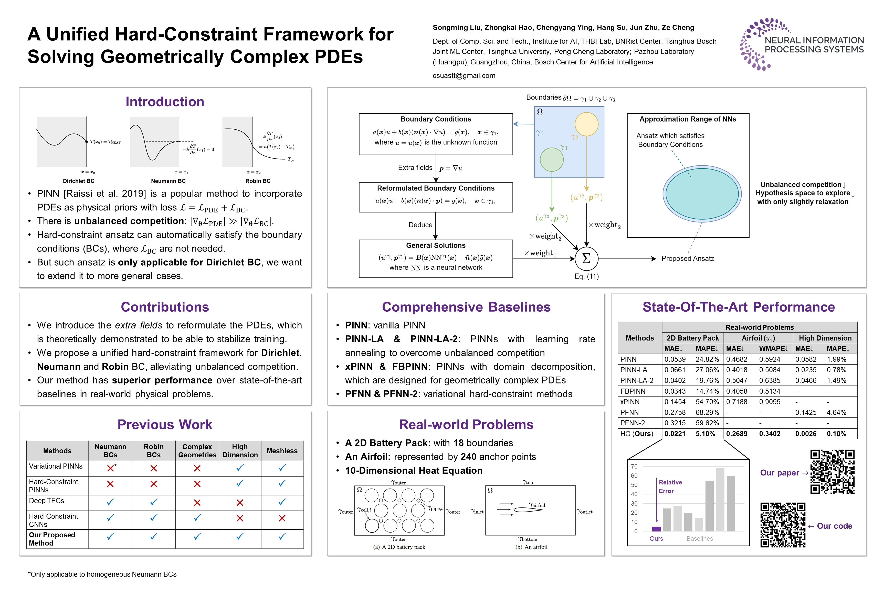
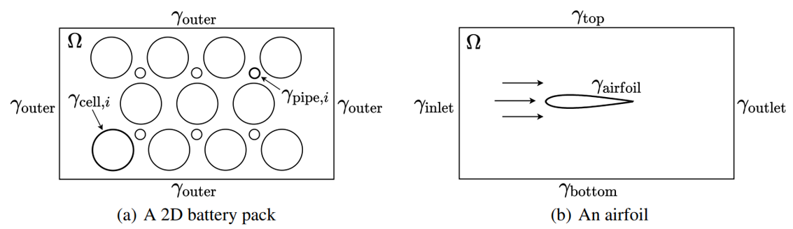
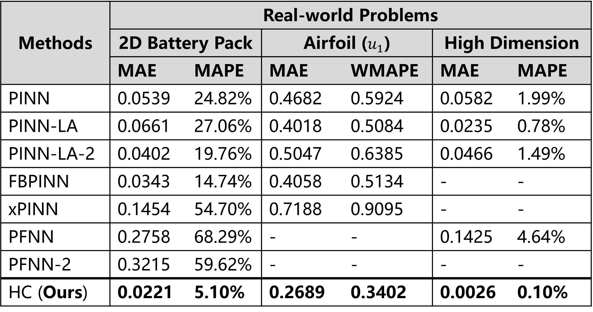

# Unified Hard-Constraint Framework

This repository is the official implementation of the NeurIPS 2022 paper: [A Unified Hard-Constraint Framework for Solving Geometrically Complex PDEs](https://arxiv.org/abs/2210.03526).

## Introduction

Physics-informed neural networks are suffering from the unbalanced competition in their loss function: $\mathcal{L}_{\mathrm{PDE}}$ vs. $\mathcal{L}_{\mathrm{BC}}$. Hard-constraint methods have been developed to alleviate such issues, which are, however, **limited to Dirichlet** boundary conditions. Our work provides a unified hard-constraint framework for the three most common types of boundary conditions: **Dirichlet, Neumann, and Robin**. The proposed method has achieved promising performance in **real-world geometrically complex problems**.



## Directory Tree

This repository is organized as:

```bash
HardConstraint/
│  README.md
│  requirements.txt       # required dependencies
│
├─data                    # data used in this paper
│      case1_pack.txt     # ground truth for "Simulation of a 2D battery pack (Heat Equation)"
│      case2_airfoil.txt  # ground truth for "Simulation of an Airfoil (Navier-Stokes Equations)"
│      w1015.dat          # achor points of the airfoil
│
├─model/                  # saved model weights (empty)
├─outs/                   # outputs (empty)
└─src
    │  case1.py           # scripts for each experiment 
    │  ...
    │
    ├─configs             # configurations for each experiment 
    │  │
    │  ├─case1
    │  │      ...
    │  │
    │  ├─case2
    │  │      ...
    │  │
    │  └─case3
    │          ...
    │
    ├─FBPINN/             # implementations of each model 
    ├─HC/
    ├─PFNN/
    ├─xPINN/
    │
    └─utils/              # some utils
```

## Getting Started

1. Install necessary dependencies:

   ```bash
   pip install -r requirements.txt
   ```

2. To train and evaluate the models in the paper, run this command:

   ```bash
   # In the root directory of this repository
   DDEBACKEND=pytorch python -m src.caseX
   ```
   
    where X = 1, 2, 3, 4, corresponding to *Simulation of a 2D battery pack (Heat Equation)*, *Simulation of an Airfoil (Navier-Stokes Equations)*, *High-dimensional Heat Equation*, and *Ablation Study: Extra fields*.

If you want to run different models (i.e., the proposed model and baselines), please modify the global variables in `src/caseX.py`.

To run the experiment of *Ablation Study: Hyper-parameters of Hardness*, you can change the value of:

- $\beta_s$ in `src/HC/l_functions.py` (line 31, default: $\beta_s=5$)
- $\beta_t$ in `src/configs/case1/hc.py` (line 127, default: $\beta_t=10$, case 1) or `src/configs/case3/hc.py` (line 56, default: $\beta_t=10$, case 3)

## Experimental Results

**Settings**:

- Evaluation Metrics: Mean Absolute Error (**MAE**), Mean Absolute Percentage Error (**MAPE**), and Weighted Mean Absolute Percentage Error (**WMAPE**)
- Baselines:
  - **PINN**: vanilla PINN
  - **PINN-LA** **& PINN-LA-2**: PINN with learning rate annealing 
  - **xPINN** **& FBPINN**: PINN with domain decomposition for geometrically complex PDEs
  - **PFNN** **& PFNN-2**: hard-constraint methods based on the variational formulation of PDEs
  - **HC**: our proposed method

**Problems**: a 2D battery pack, an airfoil, a high-dimensional heat equation



**Results**:



## Problem & Solution

1. Scalar Type Error

   ```bash
   ...
     File "ENV_PATH/lib/python3.9/site-packages/deepxde/model.py", line 228, in outputs_losses
       outputs_ = self.net(self.net.inputs)
   ...
     File "ENV_PATH/lib/python3.9/site-packages/torch/nn/functional.py", line 1848, in linear
       return torch._C._nn.linear(input, weight, bias)
   RuntimeError: expected scalar type Float but found Double
   ```

   Please modify `ENV_PATH/lib/python3.9/site-packages/deepxde/model.py (line 228)` from:

   ```python
   self.net.train(mode=training)
   self.net.inputs = torch.as_tensor(inputs)
   self.net.inputs.requires_grad_()
   outputs_ = self.net(self.net.inputs)
   ```

   to:

   ```python
   self.net.train(mode=training)
   self.net.inputs = torch.as_tensor(inputs)
   self.net.inputs.requires_grad_()
   outputs_ = self.net(self.net.inputs.float()) # add this
   ```

## Citation

If you find this work is helpful for your research, please **cite us** with the following BibTeX entry:

```
@article{liu2022unified,
  title={A Unified Hard-Constraint Framework for Solving Geometrically Complex PDEs},
  author={Liu, Songming and Hao, Zhongkai and Ying, Chengyang and Su, Hang and Zhu, Jun and Cheng, Ze},
  journal={arXiv preprint arXiv:2210.03526},
  year={2022}
}
```

